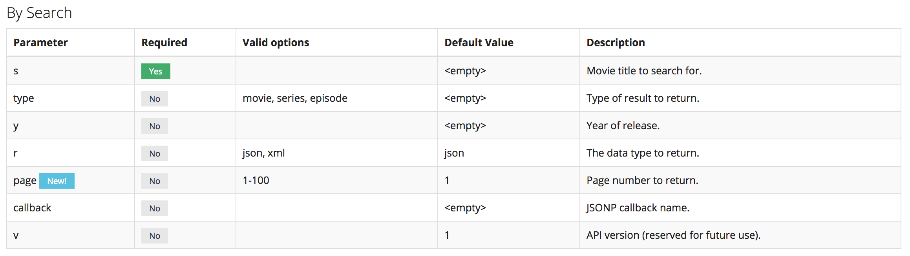

# Intro To Redux

---

## Agenda

1. Who Am I (for newbs)
1. Brief Recap of Last Week
1. What is Redux
1. Redux in Practice
1. Back to the App

---

## Who am I?

charlieblackstock@gmail.com <br>
[Github](https://github.com/blackstc)

----

### Charlie Blackstock


----

### Work


----

### Background

Business School @ CU >>> Masters @ USC >>> Public Accounting for 2 years >>> gSchool >>> Acumen Digital

----

### Coding Background

* Coding for 2.5 years
  * Started learning Ruby with my brother
* Created 40+ React & Redux applications
  * 1 AngularJS & Redux App used by 2+ million users a month
* Taught multiple workshops gSchool students and Galvanize members
* Several workshops for work clients

---

## What is Redux
1. Motivation
1. 3 Principles
1. EcoSystem

----

### Motivation
* Written by Dan Abramov
* As a result of JS SPAs, we need to manage more state than ever
* Managing state is hard
> At some point, you no longer understand what happens in your app as you have lost control over the when, why, and how of its state

* Redux attempts to make state mutations predictable

----

### 3 Principles
1. The state of your whole application is stored in an object tree within a single store.
1. The only way to change the state is to emit an action, an object describing what happened.
1. To specify how the state tree is transformed by actions, you write pure reducers.

----

### Redux State
* State (also called state tree) in redux represents the entire state of a Redux application, which is often a deeply nested object.

----

### Redux Actions
* An action is a plain object that represents an intention to change the state.
* Actions are the only way to get data into the store.
* Actions must have a **type** field that indicates the type of action being performed
  * It is better to use strings instead of symbols

----

### Redux Reducers
* A reducer is a pure function that returns the state object (or piece of state object).
* Reducers calculate a new state given the previous state and an action.
* They must be pure functions—functions that return the exact same output for given inputs.
* They should also be free of side-effects.
  * This is what enables exciting features like hot reloading and time travel.

----

### Redux Store
* A store is an object that holds the application's state tree.
* There should only be a single store in a Redux app, as the composition happens on the reducer level.
  * **dispatch(action)** is the base dispatch function described above.
  * **getState()** returns the current state of the store.
  * **subscribe(listener)** registers a function to be called on state changes.
  * **replaceReducer(nextReducer)** can be used to implement hot reloading and code splitting. Most likely you won't use it.

---

## Create Redux Example

----

### Create Store
```javascript
const store = Redux.createStore();

```

----

### Create Reducer
```javascript
const reducer = (state, action) => {
  return state;
}

const store = Redux.createStore(reducer);

// What would this return?
store.getState();
```

----

### Update Reducer
```javascript
const reducer = (state = 0, action) => {
  return state;
}

const store = Redux.createStore(reducer);

// What would this return?
store.getState();
```

----

### Create Action
```javascript
const increment = {
  type: 'INCREMENT'
}

const reducer = (state = 0, action) => {
  return state;
}

const store = Redux.createStore(reducer);

// What would this return?
store.getState();
```

----

### Dispatch Action
```javascript
const increment = {
  type: 'INCREMENT'
}

const reducer = (state = 0, action) => {
  return state;
}

const store = Redux.createStore(reducer);

store.getState();
store.dispatch(increment);
store.getState();
```

----

### Handle Action
```javascript
const increment = {
  type: 'INCREMENT'
}

const reducer = (state = 0, action) => {
  if (action.type === 'INCREMENT') {
    return ++state;
  }
  return state;
}

const store = Redux.createStore(reducer);

store.getState();
store.dispatch(increment);
store.getState();
```

----

### Create New Action
```javascript
const increment = {
  type: 'INCREMENT'
}

const decrement = {
  type: 'DECREMENT'
}

const reducer = (state = 0, action) => {
  if (action.type === 'INCREMENT') {
    return ++state;
  } else if (action.type === 'DECREMENT') {
    return --state;
  }
  return state;
}

const store = Redux.createStore(reducer);

store.getState();
store.dispatch(increment);
store.getState();
```

----

## The App

[OMDB App](https://blackstc.github.io/intro-react-redux-omdb/)

---

## Lets Look at Some Code

---

## Homework
* Add a node backend to in a separate Repo
* Add a API endpoint that we will use to search movies that returns data from the OMDB API
* Update react to user our new Node API endpoint

